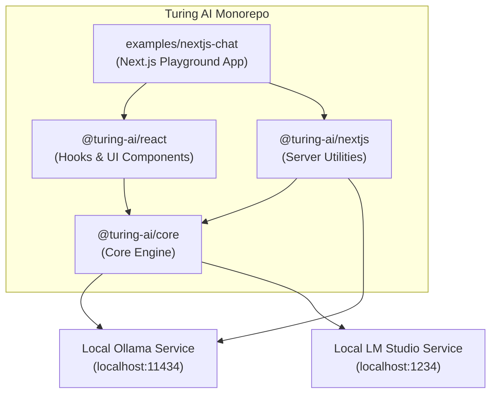
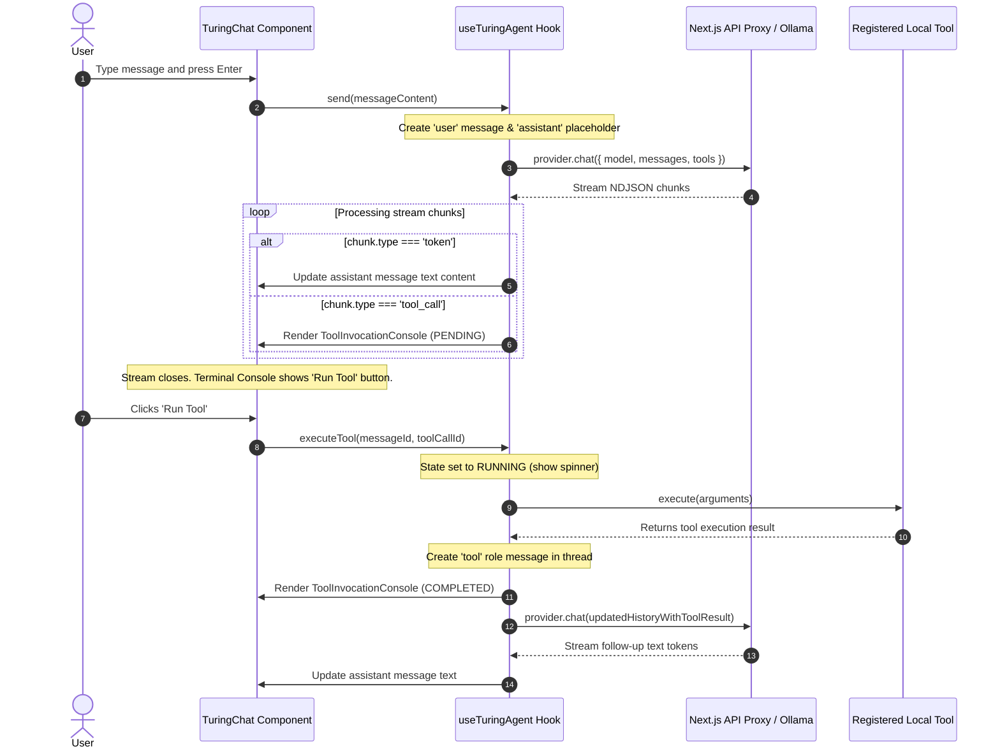

# Turing AI Architecture & Technical Documentation

This document describes the architectural layout, components, and data-flow sequences of the `@turing-ai` monorepo. It serves as the primary system design reference for building, extending, and utilizing the local-first React component library.

---

## 1. System Architecture Diagram

The codebase is organized as a Turborepo monorepo with three core packages and an example application playground. The following dependency graph illustrates the relationships between packages and external services (Ollama, LM Studio):



### Monorepo Packages Breakdown
1. **`@turing-ai/core`**: Framework-agnostic typescript package. Contains providers (`ollamaProvider`, `lmStudioProvider`), conversation memory layer (`IndexedDB`, `InMemory`), stream parsing helpers (`parseNDJSON`), and model preset definitions.
2. **`@turing-ai/react`**: React package exporting hooks (`useTuringAgent`, `useModelManager`, `useConversation`) and components (`TuringChat`, `MessageBubble`, `InputBar`, `ModelSelector`, `ThreadList`). Integrates CSS themes like `vigilante.css`.
3. **`@turing-ai/nextjs`**: Next.js proxy route handler (`createTuringHandler`) allowing requests to go through a secure, rate-limited backend instead of connecting directly from the client.

---

## 2. Message Streaming & Tool Execution Lifecycle

The sequence diagram below shows how a message flows from the user interface, streams tokens, requests a local tool execution, waits for human approval, runs the tool, and automatically feeds the output back into the AI model for completion:



---

## 3. Advanced Features Walkthrough

### 3.1 Preset Selector (Persona Configuration)
Selecting a preset persona dynamically changes the agent's behavior. When a user selects a preset (e.g. Coder, Analyst, Operative) from the header select box:
1. **Context Update**: `activePreset` state updates in `<TuringChat>`.
2. **System Prompt Alignment**: `useTuringAgent` resolves the system prompt and temperature associated with the preset.
3. **Suggestion Grid Swap**: The suggestion action card grid (e.g., Code Audit, Security Scan) swaps options to align with the new model goals.

### 3.2 Human-In-The-Loop Tool Console
Designed as a collapsible, high-fidelity developer terminal inside the message bubble:
* **Interactive Approvals**: Displays inputs in formatted, colorized JSON syntax blocks.
* **Badges & Spinners**: Renders status badges (`PENDING` in violet, `RUNNING` in yellow with a CSS keyframe-spinner, `COMPLETED` in emerald green, `FAILED` / `DECLINED` in red or slate).
* **Safe Resuming**: Once executed, the result is appended as a `tool` role message in the chat history, and generator streaming starts again to produce the final textual explanation.

### 3.3 Multi-Model Compare Mode
When Compare Mode is active, `<TuringChat>` splits the page container into two parallel columns:
* **Dual Hook Instances**: Instantiates two independent instances of `useTuringAgent` (Agent A and Agent B).
* **Parallel Streaming**: Sends prompt commands concurrently to both hooks, triggering parallel `fetch` streaming calls to the AI backend.
* **Independent Controls**: Includes two isolated `<ModelSelector>` dropdowns in the header, letting developers compare model behaviors side-by-side.

---

## 4. CSS Theme Variables (`vigilante.css`)

The core style tokens in `packages/react/src/themes/vigilante.css` use a midnight-violet hacker aesthetic:

```css
[data-turing-theme="vigilante"] {
  /* Colors */
  --tac-color-bg: #0b0f19;              /* Midnight blue background */
  --tac-color-bg-secondary: #111827;    /* Slate-900 border background */
  --tac-color-accent: #8b5cf6;          /* Violet neon accent */
  --tac-color-accent-hover: #a78bfa;    /* Bright purple hover */
  --tac-color-border: #1e293b;          /* Dark gray-blue dividers */

  /* Chat Message Bubbles */
  --tac-msg-user-bg: linear-gradient(135deg, rgba(139, 92, 246, 0.2) 0%, rgba(99, 102, 241, 0.1) 100%);
  --tac-msg-assistant-bg: rgba(255, 255, 255, 0.02);

  /* Terminal Console styling */
  --tac-code-bg: #090d16;               /* Monospace console background */
  --tac-code-text: #a78bfa;             /* Lavender code color */
}
```
